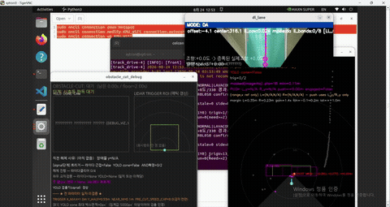

<div align="center">
<h1>UMK 🏎️🚦</h1>
<p><a href="https://auto-contest.kookmin.ac.kr/">제9회 국민대학교 자율주행 경진대회</a> 본선 참가
차량의 실차 배포 소스 — 신호등 판단부터 라바콘·고정장애물·방해차량 회피, 지름길 좌회전까지
한 대의 ROS2 노드(`track_drive`)로 처리하는 자율주행 트랙 경주 로봇.</p>


</div>

---

## 개요

미래관(신관) 4층 자율주행스튜디오 트랙을 반시계방향으로 3바퀴 도는 본선 경기용 코드다.
매 바퀴 4구 신호등(직진/좌회전) 판단으로 시작해, 차선 주행 중 **라바콘(B1) → 고정장애물(B2)
→ 방해차량(B3)** 순서로 세 가지 회피 미션을 통과하고, 2·3바퀴째 중 한 번은 신호가 좌회전을
지시하면 지름길로 빠졌다가 T자 교차로에서 되돌아온다. 완주 판정은 심판이 통과시점을 재는
방식이라 차량이 결승선에서 스스로 멈추지는 않는다.

### 차량/현장 사양

| 항목 | 값 |
|---|---|
| 섀시 | 자이카 Y모델, Traxxas 1:10 스케일 |
| 카메라 | 170° 어안렌즈 640×480 |
| 본선 컴퓨트 | reComputer Super J4012 (Jetson Orin NX 16GB, JetPack 6 / Ubuntu 22.04) |
| 트랙 | 국민대 미래관(신관) 4층 자율주행스튜디오 |

---

## 아키텍처

```
perceive_all() → _update_lap() → run_mission_fsm()
  → (S1_LANE_FOLLOW && Behavior 활성) run_behavior_fsm() → apply_behavior_override()
  → drive(ctrl_angle, ctrl_speed) 발행
```
20Hz(`control_loop()`) 타이머로 인지→판단→제어→발행 한 사이클을 반복한다.

| 패키지 | 역할 |
|---|---|
| [`track_drive/`](track_drive/track_drive/) | 메인 제어 노드 — 인지·상태머신·제어 전부 여기 있음 |
| [`yolo_ros/`](yolo_ros/) | 코드 없음, YOLOv8 가중치 파일 저장소(별도 다운로드 — 아래 참고) |
| [`xycar_device/`](xycar_device/) | 벤더 드라이버(IMU 등) |

라이다/카메라/IMU를 각각 별도 노드로 띄우고 인지·판단·제어는 `track_drive` 노드 하나가 전담한다
— 예전엔 YOLO도 별도 ROS 노드였으나, 지금은 `track_drive`가 ONNX 모델을 직접 불러 같은 프로세스
안에서 추론한다(`perception/yolo_*.py`).

---

## 상태 머신

### Mission — `S0_SIGNAL` → `S1_LANE_FOLLOW` → (`S4_FINISH`, 실제로는 도달 안 함)

| State | 역할 |
|---|---|
| `S0_SIGNAL` | 4구 신호등 판단(출발선/교차로 공용) — 좌회전 확정이면 커밋 구간 주행 후 지름길 진입 램프 실행 |
| `S1_LANE_FOLLOW` | 차선 주행 — B1/B2/B3 Behavior가 이 상태 안에서 순서대로 발동 |
| `S4_FINISH` | 핸들러는 존재하나 전환 로직 없음(완주는 심판 판정) |

신호등(`signal_state_best_n.onnx`, YOLOv8 파인튜닝 — 보드 위치+색상을 한 모델이 동시 예측)이
직진을 확정하면 정지 없이 곧장 다음 바퀴 Behavior를 재무장하고 `S1`을 유지한다. 좌회전을
확정하면 물리적 분기점까지 주행 후 지름길 진입 램프를 탄다.

### Behavior — `Phase.LAVACON` → `Phase.OBSTACLE_ZONE` → `Phase.DONE`

**B1, 라바콘** — 라이다 좌우 클러스터 + YOLO 콘 검출이 동시에 확정되면 진입. 진입 직후
0.4초간 고정 조향각(-30°)을 한 번 꽂아 확실히 꺾어준 뒤, da(주행가능영역) 경로를 그대로
따르되 콘이 안전마진 안으로 침범하면 그만큼 반대쪽으로 경로를 밀어(`_lavacon_steer_da_push()`)
Pure Pursuit에 넘긴다. 좌우 라이다 클러스터가 약 2초간 모두 사라지면 구간 종료.

**B2/B3, 고정장애물·방해차량** — 별도 회피 상태로 전환하지 않고, da 근접 컷(라이다+YOLO
이중확인으로 장애물 쪽 주행가능영역을 그 자리에서 잘라내는 방식)이 항상 켜진 채 알아서
처리한다. 트랙 순서는 **고정장애물(B2)이 먼저** — 방해차량으로 오분류될 여지가 있는 시점을
막기 위해, B2 통과 후 3초 동안은 뭐가 잡혀도 B2로 취급한다.

### 지름길(좌회전)

신호 좌회전 확정 → 커밋 구간 주행 → 라이다로 체크무늬 게이트 기둥쌍 검출 → 완만한 조향
램프(0°→-25°, 2.5m)로 진입 → 곧장 차선 주행 복귀(다음 구간 B1 재무장). 지름길 출구는
T자 교차로라 차선 인식만으로는 방향을 못 정하므로(반시계방향 트랙이라 항상 좌회전이어야
하지만 인식 결과는 그 규칙을 모름), 입구 램프 완료 후 누적거리 5.5m 지점에서 고정 조향각
(-20°, 0.5초)을 강제로 꽂아 빠져나온다. 지름길 이후엔 더 볼 Behavior가 없어 곧장 결승선으로
이어진다.

---

## 인지 스택

| 대상 | 방식 | 모델 |
|---|---|---|
| 차선/주행가능영역(da) | TwinLiteNet+ 듀얼헤드 세그멘테이션 | [TwinLiteNet-KMU-finetune](https://github.com/mastic-choi/TwinLiteNet-KMU-finetune) v1.2.0 |
| 라바콘 | YOLOv8n 파인튜닝 | `cone_best_n.onnx` (이 저장소에 포함) |
| 방해차량 | YOLOv8n 파인튜닝 | [yolo-V8-KMU-xycar](https://github.com/mastic-choi/yolo-V8-KMU-xycar) `target_vehicle` v1.2.0 |
| 신호등 위치+색상 | YOLOv8n 파인튜닝(동시 예측) | [yolo-V8-KMU-xycar](https://github.com/mastic-choi/yolo-V8-KMU-xycar) `signal_state` v1.2.0 |

라이다는 별도 검출기 없이 트리거 3종(라바콘 진입, 체크무늬 게이트, 근접 회피)을 각각
좁은 ROI + 카메라 이중확인 + 프레임 디바운스로 판정한다.

---

## 모델 다운로드

용량 문제로 자체 파인튜닝 가중치는 각 전용 저장소에서 따로 받는다(이 저장소엔 코드와
`cone_best_n.onnx`만 포함). `colcon build` 전에 아래 경로에 배치할 것 — `.gitignore`에
이미 등록돼 있어 받아둬도 커밋되지 않는다.

```
track_drive/track_drive/models/twinlitenetplus_kmu_v1.2.0.onnx(+.onnx.data)
  ← TwinLiteNet-KMU-finetune (outputs/models/best.onnx, v1.2.0 medium)
yolo_ros/signal_state_best_n.onnx
  ← yolo-V8-KMU-xycar (signal_state, v1.2.0)
yolo_ros/target_vehicle_best.onnx
  ← yolo-V8-KMU-xycar (target_vehicle, v1.2.0)
```

---

## 실행

```bash
# xycar_ws/src/ 아래 track_drive, xycar_device를 배치하고
colcon build --packages-select track_drive xycar_imu
source install/setup.bash
ros2 launch track_drive track_drive.launch.py
```
카메라/라이다/IMU 드라이버를 함께 띄우고 `track_drive` 노드를 시작한다. 디버그 시각화
창(`DEBUG_VIZ_*`, `config.py`)은 경기 기본값에서 전부 꺼져 있다 — 튜닝 시에만 개별적으로 켤 것.

---

## 레포 구성

```
track_drive/
  track_drive/
    track_drive.py        # 메인 제어 노드 — 상태머신/제어 루프
    config.py              # 튜닝 상수 + 상태 Enum
    perception/            # 차선(da/ll), 라바콘, 신호등, YOLO 검출기
    controller/             # Pure Pursuit 등 조향 컨트롤러
    models/                 # TwinLiteNet 가중치(다운로드 필요, 위 참고)
    README.md               # 내부 아키텍처 참고문서
  launch/                    # ROS2 launch 파일
yolo_ros/                    # YOLOv8 가중치 저장소(다운로드 필요)
xycar_device/                # 벤더 드라이버(IMU 등)
```

## 관련 링크

- 차선 인식 파인튜닝: [TwinLiteNet-KMU-finetune](https://github.com/mastic-choi/TwinLiteNet-KMU-finetune)
- 방해차량/신호등 파인튜닝: [yolo-V8-KMU-xycar](https://github.com/mastic-choi/yolo-V8-KMU-xycar)
- 내부 아키텍처 문서: [`track_drive/track_drive/README.md`](track_drive/track_drive/README.md)
